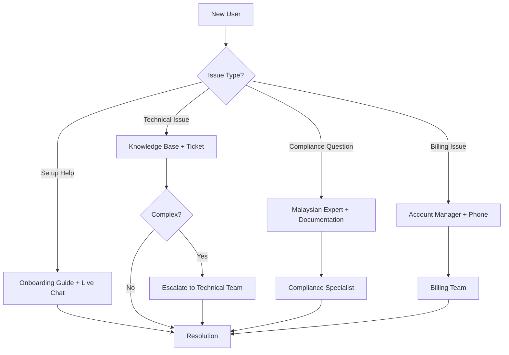
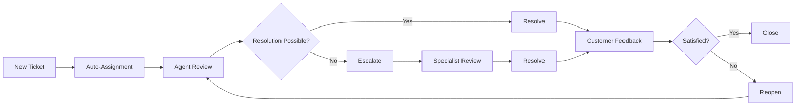
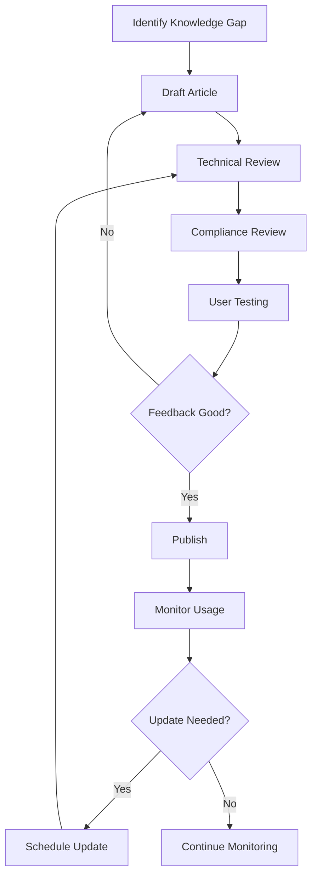
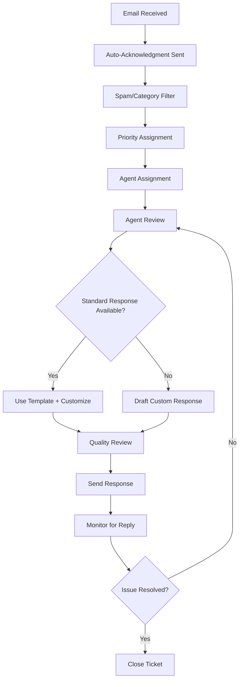

# Customer Support Infrastructure

## Overview

This document outlines the comprehensive customer support infrastructure for Easy e-Invoice, designed to provide exceptional service to Malaysian micro-SMEs while ensuring efficient resolution of inquiries, compliance questions, and technical issues.

## Table of Contents

1. [Support Channel Strategy](#support-channel-strategy)
2. [Support Team Structure](#support-team-structure)
3. [Ticket Management System](#ticket-management-system)
4. [Knowledge Base Management](#knowledge-base-management)
5. [Live Chat Implementation](#live-chat-implementation)
6. [Phone Support Operations](#phone-support-operations)
7. [Email Support Workflow](#email-support-workflow)
8. [Malaysian Compliance Support](#malaysian-compliance-support)
9. [Escalation Procedures](#escalation-procedures)
10. [Performance Metrics & SLAs](#performance-metrics--slas)

---

## Support Channel Strategy

### Multi-Channel Support Approach

**Primary Channels:**
- 💬 **Live Chat** (Real-time, business hours)
- 📧 **Email Support** (Asynchronous, 24/7 intake)
- 📞 **Phone Support** (Premium customers, business hours)
- 📚 **Self-Service** (Knowledge base, FAQs)

**Secondary Channels:**
- 💬 **Community Forum** (User-to-user support)
- 🎥 **Video Support** (Screen sharing for complex issues)
- 🚨 **Emergency Support** (Critical issues, 24/7)

### Channel Selection Matrix

```yaml
support_channels:
  immediate_assistance:
    primary: "live_chat"
    fallback: "phone_support"
    availability: "9 AM - 6 PM GMT+8, Mon-Fri"
    
  detailed_queries:
    primary: "email_support"
    response_time: "4-8 hours (business days)"
    availability: "24/7 intake"
    
  self_service:
    primary: "knowledge_base"
    secondary: "community_forum"
    availability: "24/7"
    
  critical_issues:
    primary: "emergency_support"
    escalation: "immediate"
    availability: "24/7"
```

### Customer Journey Support Mapping



---

## Support Team Structure

### Team Organization

**Tier 1 - Frontline Support (4 agents)**
- Initial contact and triage
- Common questions and basic troubleshooting
- Account management and billing inquiries
- Live chat and phone support

**Tier 2 - Technical Specialists (2 agents)**
- Complex technical issues
- Integration problems
- Data import/export issues
- System configuration

**Tier 3 - Malaysian Compliance Experts (2 specialists)**
- LHDN regulations and compliance
- TIN validation issues
- Industry code classification
- MyInvois integration problems

**Management & Escalation (1 manager)**
- Team leadership and coordination
- Escalation handling
- Customer success management
- Performance monitoring

### Role Definitions

#### Tier 1 Support Agent
```yaml
responsibilities:
  - Handle initial customer inquiries
  - Provide basic platform navigation help
  - Process account and billing requests
  - Escalate complex technical issues
  - Maintain customer satisfaction scores

qualifications:
  - Customer service experience (2+ years)
  - Basic understanding of invoicing
  - Excellent communication skills (English/Bahasa Malaysia)
  - Problem-solving abilities

training_required:
  - Easy e-Invoice platform (20 hours)
  - Malaysian business basics (10 hours)
  - Customer service protocols (8 hours)

tools_access:
  - Zendesk (ticket management)
  - Intercom (live chat)
  - Admin dashboard (limited)
  - Knowledge base (full access)
```

#### Tier 2 Technical Specialist
```yaml
responsibilities:
  - Resolve complex technical issues
  - Handle integration and API problems
  - Assist with bulk data operations
  - Create technical documentation
  - Support agent training

qualifications:
  - Technical background (3+ years)
  - Experience with web applications
  - Database query capabilities
  - Understanding of APIs and integrations

training_required:
  - Platform architecture (40 hours)
  - Database structure (16 hours)
  - API documentation (12 hours)
  - Troubleshooting methodologies (8 hours)

tools_access:
  - Full admin dashboard
  - Database query tools (read-only)
  - Log analysis tools
  - System monitoring
```

#### Tier 3 Compliance Expert
```yaml
responsibilities:
  - Malaysian e-Invoice regulation expertise
  - LHDN and MyInvois guidance
  - TIN and industry code validation
  - Compliance training development
  - Regulatory update communication

qualifications:
  - Accounting or tax background (5+ years)
  - Malaysian tax regulations knowledge
  - LHDN e-Invoice certification
  - Business consulting experience

training_required:
  - LHDN e-Invoice regulations (32 hours)
  - Platform compliance features (24 hours)
  - MyInvois integration (16 hours)
  - Industry classification (8 hours)

tools_access:
  - Compliance monitoring tools
  - LHDN regulatory databases
  - Validation rule management
  - Compliance reporting
```

---

## Ticket Management System

### Ticket Classification System

**Priority Levels:**
- **P1 - Critical**: System down, data loss, security breach
- **P2 - High**: Feature not working, payment issues, compliance problems
- **P3 - Medium**: Minor bugs, feature requests, general questions
- **P4 - Low**: Enhancement requests, documentation updates

**Category Classification:**
```yaml
ticket_categories:
  technical:
    - platform_issues
    - integration_problems
    - data_import_export
    - performance_issues
    
  compliance:
    - malaysian_regulations
    - tin_validation
    - industry_codes
    - myinvois_integration
    
  billing:
    - payment_issues
    - subscription_changes
    - refund_requests
    - invoice_disputes
    
  account:
    - login_problems
    - user_management
    - permissions_access
    - profile_updates
    
  general:
    - how_to_questions
    - feature_requests
    - feedback
    - partnerships
```

### Ticket Lifecycle Management



### SLA Targets

| Priority | First Response | Resolution Time | Escalation Time |
|----------|---------------|-----------------|-----------------|
| P1 Critical | 30 minutes | 4 hours | 1 hour |
| P2 High | 2 hours | 24 hours | 4 hours |
| P3 Medium | 8 hours | 72 hours | 24 hours |
| P4 Low | 24 hours | 7 days | 72 hours |

### Automated Ticket Routing

```javascript
const ticketRouting = {
  // Auto-assignment rules
  routing_rules: [
    {
      condition: "keyword_match(['billing', 'payment', 'subscription'])",
      action: "assign_to_billing_specialist",
      priority: "high"
    },
    {
      condition: "keyword_match(['tin', 'compliance', 'lhdn', 'myinvois'])",
      action: "assign_to_compliance_expert",
      priority: "medium"
    },
    {
      condition: "keyword_match(['api', 'integration', 'import', 'export'])",
      action: "assign_to_technical_specialist",
      priority: "medium"
    },
    {
      condition: "customer_tier === 'premium'",
      action: "priority_queue",
      priority: "elevated"
    }
  ],
  
  // Load balancing
  load_balancing: {
    method: "round_robin_with_capacity",
    factors: ["agent_availability", "ticket_load", "specialization_match"]
  },
  
  // Escalation triggers
  escalation_triggers: [
    "sla_breach_approaching",
    "customer_dissatisfaction",
    "multiple_reopens",
    "agent_request"
  ]
}
```

---

## Knowledge Base Management

### Content Structure

```yaml
knowledge_base:
  categories:
    getting_started:
      articles: 15
      avg_rating: 4.8
      most_viewed: "Creating Your First Invoice"
      
    invoice_management:
      articles: 25
      avg_rating: 4.6
      most_viewed: "Understanding Compliance Scores"
      
    customer_management:
      articles: 12
      avg_rating: 4.7
      most_viewed: "Importing Customer Data"
      
    malaysian_compliance:
      articles: 20
      avg_rating: 4.9
      most_viewed: "TIN Number Validation"
      
    troubleshooting:
      articles: 30
      avg_rating: 4.5
      most_viewed: "Login Issues"
      
    api_documentation:
      articles: 18
      avg_rating: 4.4
      most_viewed: "Authentication Guide"
```

### Content Creation Workflow



### Self-Service Analytics

```javascript
const selfServiceMetrics = {
  // Deflection rates
  deflection_targets: {
    tier1_deflection: "60%", // Tier 1 inquiries resolved by KB
    overall_deflection: "40%", // All inquiries resolved by self-service
    search_success_rate: "85%" // Users find helpful content
  },
  
  // Content performance
  article_metrics: [
    "page_views",
    "time_on_page", 
    "helpful_votes",
    "ticket_deflection",
    "completion_rate"
  ],
  
  // User behavior tracking
  user_journey: [
    "search_queries",
    "article_path",
    "exit_points",
    "conversion_to_ticket"
  ]
}
```

---

## Live Chat Implementation

### Chat Platform Configuration

**Platform**: Intercom (or similar)
**Integration**: Embedded widget + mobile app
**Features**: File sharing, screen sharing, co-browsing

### Chat Workflow Design

```yaml
live_chat:
  pre_chat_form:
    required_fields:
      - name
      - email
      - organization
      - issue_category
    optional_fields:
      - phone_number
      - urgency_level
      - previous_ticket_id
      
  routing_logic:
    business_hours:
      - check_agent_availability
      - match_specialization
      - balance_queue_load
    after_hours:
      - collect_contact_info
      - set_expectations
      - offer_callback_option
      
  conversation_flow:
    greeting:
      automated: "Hi! I'm here to help with Easy e-Invoice. What can I assist you with today?"
      personalized: "Welcome back, [Name]! How can I help you today?"
      
    problem_identification:
      - understand_issue
      - gather_context
      - check_account_details
      - review_recent_activity
      
    resolution_attempt:
      - provide_guidance
      - screen_share_if_needed
      - escalate_if_complex
      - create_ticket_if_unresolved
      
    follow_up:
      - confirm_resolution
      - gather_feedback
      - provide_additional_resources
      - schedule_callback_if_needed
```

### Chat Bot Integration

```javascript
const chatBot = {
  // Initial triage
  triage_questions: [
    {
      question: "What type of help do you need today?",
      options: [
        "Getting started with invoices",
        "Technical issue or bug",
        "Malaysian compliance question",
        "Billing or account question",
        "General question"
      ]
    },
    {
      condition: "issue_type === 'technical'",
      question: "Can you describe the issue?",
      type: "free_text",
      followup: "suggest_knowledge_articles"
    }
  ],
  
  // Auto-responses
  common_responses: {
    tin_format: "Malaysian TIN format for companies is C followed by 10 digits, like C1234567890. Would you like me to connect you with a compliance expert?",
    
    login_issue: "For login issues, first try clearing your browser cache and requesting a new magic link. Here's a step-by-step guide: [link]. Still having trouble?",
    
    invoice_creation: "I can help you create your first invoice! Would you prefer a guided tour or to speak with a human agent?"
  },
  
  // Escalation triggers
  escalation_signals: [
    "user_frustration_keywords",
    "multiple_failed_suggestions", 
    "complex_technical_language",
    "explicit_agent_request"
  ]
}
```

---

## Phone Support Operations

### Phone System Setup

**Platform**: VoIP system with Malaysian local numbers
**Hours**: 9 AM - 6 PM GMT+8, Monday to Friday
**Languages**: English and Bahasa Malaysia
**Recording**: All calls recorded for quality assurance

### Call Handling Process

```yaml
phone_support:
  call_flow:
    greeting:
      english: "Thank you for calling Easy e-Invoice support. This is [Agent Name]. How can I help you today?"
      bahasa: "Terima kasih kerana menghubungi sokongan Easy e-Invoice. Saya [Nama Agen]. Bagaimana saya boleh membantu anda hari ini?"
      
    verification:
      - confirm_caller_identity
      - verify_organization
      - check_account_status
      - note_call_reason
      
    issue_resolution:
      - understand_problem
      - access_account_if_needed
      - provide_screen_guidance
      - document_solution
      
    call_conclusion:
      - summarize_resolution
      - provide_ticket_number
      - offer_additional_help
      - gather_satisfaction_rating
      
  call_types:
    urgent_technical:
      priority: "immediate"
      max_hold_time: "30 seconds"
      callback_option: true
      
    billing_inquiry:
      priority: "high"
      verification_required: "enhanced"
      recording_mandatory: true
      
    general_support:
      priority: "standard"
      knowledge_base_first: true
      transfer_to_chat_option: true
```

### Call Quality Management

```javascript
const callQuality = {
  // Quality scorecard
  evaluation_criteria: [
    "greeting_professionalism",
    "problem_understanding",
    "solution_accuracy", 
    "communication_clarity",
    "call_resolution",
    "customer_satisfaction"
  ],
  
  // Monitoring schedule
  call_monitoring: {
    new_agents: "100% for first month",
    experienced_agents: "20% random sampling",
    escalated_calls: "100% review"
  },
  
  // Performance metrics
  kpis: {
    average_call_time: "8 minutes",
    first_call_resolution: "85%",
    customer_satisfaction: "4.5/5",
    abandonment_rate: "<3%"
  }
}
```

---

## Email Support Workflow

### Email Management System

**Platform**: Zendesk (or similar ticketing system)
**Response Templates**: 50+ pre-written responses
**Auto-Responders**: Immediate acknowledgment with expected response time

### Email Processing Workflow



### Email Templates

```yaml
email_templates:
  acknowledgment:
    subject: "We've received your support request - Ticket #[TICKET_ID]"
    body: |
      Dear [CUSTOMER_NAME],
      
      Thank you for contacting Easy e-Invoice support. We've received your request and assigned it ticket number [TICKET_ID].
      
      Expected Response Time: [SLA_TIME]
      Priority Level: [PRIORITY]
      
      You can check the status of your ticket at: [TICKET_URL]
      
      Best regards,
      Easy e-Invoice Support Team
      
  tin_validation_help:
    subject: "Malaysian TIN Format Guidance - Ticket #[TICKET_ID]"
    body: |
      Dear [CUSTOMER_NAME],
      
      I understand you're having trouble with TIN number validation. Here's the correct format for Malaysian TIN numbers:
      
      **For Companies (Sdn Bhd, Bhd):**
      - Format: C + 10 digits
      - Example: C1234567890
      - Total length: 11 characters
      
      **For Individuals:**
      - Format: 12 digits (IC number)
      - Example: 123456789012
      - No letters or special characters
      
      [Additional guidance based on specific issue]
      
      If you're still having trouble, please reply with your TIN number (we'll verify the format) or let me know if you'd like to schedule a quick call.
      
      Best regards,
      [AGENT_NAME]
      
  billing_inquiry:
    subject: "Billing Inquiry Response - Ticket #[TICKET_ID]"
    body: |
      Dear [CUSTOMER_NAME],
      
      I've reviewed your billing inquiry and here's what I found:
      
      [CUSTOMIZED_RESPONSE_BASED_ON_INQUIRY]
      
      Current subscription: [PLAN_NAME]
      Next billing date: [BILLING_DATE]
      Outstanding amount: [AMOUNT]
      
      [SPECIFIC_ACTIONS_OR_RESOLUTIONS]
      
      Please let me know if you have any other questions about your account.
      
      Best regards,
      [AGENT_NAME]
```

---

## Malaysian Compliance Support

### Specialized Compliance Team

**Team Composition:**
- 2 Malaysian tax/accounting experts
- 1 LHDN liaison specialist
- 1 MyInvois integration expert

### Compliance Support Categories

```yaml
compliance_support:
  regulatory_guidance:
    - lhdn_requirements
    - myinvois_integration
    - e_invoice_mandate_timeline
    - penalty_and_enforcement
    
  technical_compliance:
    - tin_validation_rules
    - industry_code_classification
    - sst_calculation_verification
    - b2b_vs_b2c_requirements
    
  implementation_support:
    - platform_configuration
    - workflow_optimization  
    - template_customization
    - training_and_adoption
    
  ongoing_monitoring:
    - compliance_score_improvement
    - regulatory_update_communication
    - audit_preparation_assistance
    - best_practices_guidance
```

### Compliance Knowledge Base

```yaml
compliance_kb:
  lhdn_regulations:
    - official_guidelines: "Latest LHDN e-Invoice guidelines with updates"
    - implementation_timeline: "Phased rollout schedule and requirements"
    - penalties: "Non-compliance consequences and mitigation"
    
  tin_management:
    - format_validation: "Complete TIN format guide with examples"
    - verification_process: "How to verify TIN numbers with authorities"
    - common_errors: "Troubleshooting TIN validation failures"
    
  industry_classification:
    - msic_2008_codes: "Searchable database of industry codes"
    - classification_guide: "How to select correct industry code"
    - code_updates: "Changes and additions to classification system"
    
  sst_compliance:
    - rate_structure: "Current SST rates and applications"
    - calculation_methods: "Step-by-step SST calculation guides"
    - exemptions: "Items and services exempt from SST"
```

---

## Escalation Procedures

### Escalation Triggers

**Automatic Escalations:**
- SLA breach approaching (80% of time elapsed)
- Customer satisfaction score below 3/5
- Multiple ticket reopenings (3+ times)
- Security or compliance violations
- Technical issues affecting multiple customers

**Manual Escalations:**
- Agent requests supervisor assistance
- Customer requests manager involvement
- Complex technical or compliance issues
- Billing disputes over threshold amount

### Escalation Matrix

```yaml
escalation_levels:
  level_1_to_2:
    trigger: "technical_complexity OR sla_risk"
    timeline: "within 2 hours of identification"
    notification: "tier_2_specialist + customer_update"
    
  level_2_to_3:
    trigger: "specialist_expertise_needed OR compliance_issue"
    timeline: "within 4 hours of escalation"
    notification: "compliance_expert + management_alert"
    
  management_escalation:
    trigger: "customer_escalation OR critical_issue OR legal_concern"
    timeline: "within 1 hour of identification"
    notification: "support_manager + account_manager + executive_team"
    
  executive_escalation:
    trigger: "regulatory_violation OR major_outage OR legal_action"
    timeline: "immediate"
    notification: "ceo + cto + legal_counsel"
```

### Escalation Communication Templates

```yaml
escalation_communications:
  to_customer:
    level_1_to_2: |
      Dear [CUSTOMER_NAME],
      
      I'm escalating your case to our technical specialist team to ensure you receive the best possible assistance with your [ISSUE_TYPE]. 
      
      A specialist will contact you within [TIMEFRAME] with a resolution.
      
      Your ticket remains: [TICKET_ID]
      
  to_internal_team:
    management_alert: |
      ESCALATION ALERT - Ticket #[TICKET_ID]
      
      Customer: [CUSTOMER_NAME] ([TIER])
      Issue: [ISSUE_SUMMARY]
      Escalation Reason: [TRIGGER]
      Agent: [AGENT_NAME]
      
      Customer Impact: [IMPACT_LEVEL]
      Actions Taken: [SUMMARY]
      Immediate Attention Required: [YES/NO]
```

---

## Performance Metrics & SLAs

### Key Performance Indicators

```yaml
support_kpis:
  response_metrics:
    first_response_time:
      target: "< 2 hours (business hours)"
      measurement: "time from ticket creation to first agent response"
      current: "1.8 hours average"
      
    resolution_time:
      target: "< 24 hours (P2 issues)"
      measurement: "time from creation to resolution"
      current: "18.5 hours average"
      
  quality_metrics:
    first_contact_resolution:
      target: "> 75%"
      measurement: "issues resolved without escalation"
      current: "78%"
      
    customer_satisfaction:
      target: "> 4.0/5.0"
      measurement: "post-resolution survey scores"
      current: "4.2/5.0"
      
    ticket_volume:
      current: "450 tickets/month"
      trend: "+12% month-over-month"
      capacity: "600 tickets/month"
      
  efficiency_metrics:
    agent_utilization:
      target: "75-85%"
      current: "82%"
      
    knowledge_base_deflection:
      target: "> 40%"
      current: "38%"
      
    escalation_rate:
      target: "< 15%"
      current: "12%"
```

### SLA Framework

| Metric | P1 Critical | P2 High | P3 Medium | P4 Low |
|--------|-------------|---------|-----------|---------|
| **First Response** | 30 min | 2 hours | 8 hours | 24 hours |
| **Resolution** | 4 hours | 24 hours | 72 hours | 7 days |
| **Escalation** | 1 hour | 4 hours | 24 hours | 72 hours |
| **Customer Update** | Every hour | Every 4 hours | Daily | Weekly |

### Performance Monitoring Dashboard

```javascript
const performanceDashboard = {
  // Real-time metrics
  live_metrics: [
    "active_chats",
    "queue_length",
    "average_wait_time",
    "agent_availability"
  ],
  
  // Daily metrics  
  daily_tracking: [
    "tickets_received",
    "tickets_resolved", 
    "sla_compliance_rate",
    "customer_satisfaction"
  ],
  
  // Trending analysis
  trend_analysis: [
    "ticket_volume_trends",
    "common_issue_patterns",
    "seasonal_variations",
    "agent_performance_trends"
  ],
  
  // Alerting thresholds
  alert_triggers: {
    sla_breach_risk: "when SLA compliance drops below 90%",
    queue_overload: "when average wait time exceeds 5 minutes",  
    satisfaction_drop: "when CSAT drops below 4.0",
    agent_overload: "when utilization exceeds 90%"
  }
}
```

### Quality Assurance Program

```yaml
quality_assurance:
  ticket_review:
    sample_rate: "20% random + 100% escalated tickets"
    review_criteria:
      - technical_accuracy
      - communication_quality
      - process_adherence
      - customer_focus
      - resolution_effectiveness
      
  agent_coaching:
    frequency: "bi-weekly one-on-ones"
    focus_areas:
      - performance_gaps
      - skill_development
      - customer_feedback
      - process_improvements
      
  continuous_improvement:
    monthly_review: "team performance and process optimization"
    quarterly_training: "new features and compliance updates"
    annual_review: "comprehensive system and strategy evaluation"
```

---

This comprehensive customer support infrastructure ensures Easy e-Invoice can provide exceptional service to Malaysian micro-SMEs while efficiently managing inquiries, maintaining compliance expertise, and delivering consistent customer satisfaction.